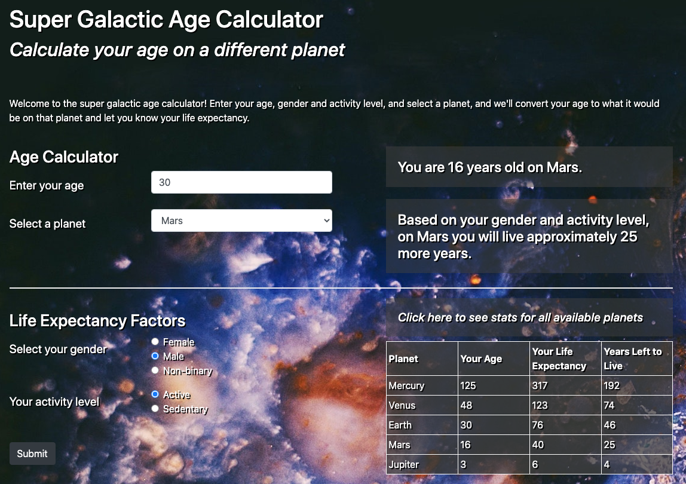

# Super Galactic Age Calculator

### Calculate your age on another planet.

### _By Micah Olson_

## Technologies Used
* HTML
* CSS
* JavaScript
* Bootstrap 4.6
* jQuery 3.5.1
* Node.js 14.15.5
* npm 6.14.10
* webpack 4.39.3
* ESLint 6.3.1
* Jest 24.9.0
* Markdown 1.0.1

## Description
Enter your age and select a planet and we'll tell you what your age would be on that planet based on its solar year.  Answering a couple additional questions will help us determine your life expectancy and you'll see how that changes on different planets. 
  

  

## Setup and Installation
* **Clone the repository** to a local directory using the command-line tool `git` ([how to install git](https://www.learnhowtoprogram.com/introduction-to-programming/getting-started-with-intro-to-programming/git-and-github)).  
  `$ cd ~/[directory]/[path]/[of]/[choice]/`  
  `$ git clone https://github.com/MicahOlson/galactic-age.git`  

* **Navigate into the project** using `cd` to move to the top level of the project directory.  
  `$ cd galactic-age/`   

* **Install all application dependencies** using the `Node.js` package manager `npm`. You will need `Node.js` to be able to use `npm` ([how to install node and npm](https://www.learnhowtoprogram.com/intermediate-javascript/getting-started-with-javascript/installing-node-js)).  
  `$ npm install`

* Then **build a distribution bundle** by running the following. This will create the version of `index.html` you will access as discussed a few points below.  
  `$ npm run build`

* **Run the full `Jest` test suite** to see all tests used in development, verify all *business logic* has 100% line coverage with these tests, and be confident all methods are behaving as expected.  
  `$ npm test`  

* To view the site locally, **start the preconfigured development server** to automatically launch the site in your default browser.  
  `$ npm run start`
  
  * You could also open the file called `index.html` in the project's `dist/` subdirectory to view a static version.  
  `$ cd dist/`  
  `$ open index.html`  

  * Alternatively, you can navigate to these project directories through your system's GUI file manager, then double-click `index.html` to open it in your default browser.  

* To edit the project, open the files in your preferred code editor. Here are some recommendations:
  * [Visual Studio Code](https://code.visualstudio.com) - "Code editing. Redefined."
  * [Atom](https://atom.io) - "A hackable text editor for the 21st Century"
  * [SublimeText](https://www.sublimetext.com) - "A sophisticated text editor for code, markup and prose"  

## Known Bugs
* No known bugs.
* If you find a bug, please report it to me at the email address below.

## License
[GPLv3](https://choosealicense.com/licenses/gpl-3.0/)\
Copyright &copy; 2021 Micah L. Olson

## Contact Information
Micah Olson micah.olson@protonmail.com